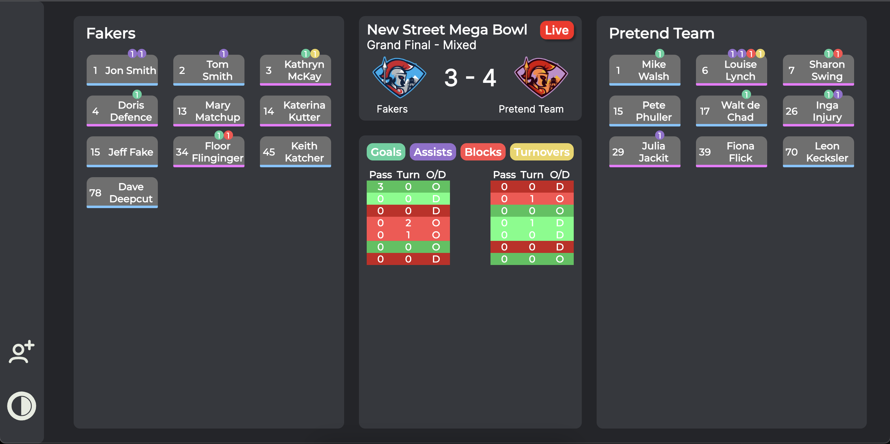
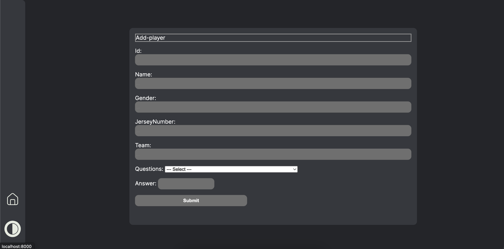

> _Fork_ deze leertaak en ga aan de slag. Onderstaande outline ga je gedurende deze taak in jouw eigen GitHub omgeving uitwerken. De instructie vind je in: [docs/INSTRUCTIONS.md](docs/INSTRUCTIONS.md)

# Titel

UltiTV Commentary Dashboard

## Inhoudsopgave

- [Beschrijving](#beschrijving)
- [Gebruik](#gebruik)
- [Kenmerken](#kenmerken)
- [Installatie](#installatie)
- [Bronnen](#bronnen)
- [Licentie](#licentie)

## Beschrijving

<!-- Bij Beschrijving staat kort beschreven wat voor project het is en wat je hebt gemaakt -->
<!-- Voeg een mooie poster visual toe 📸 -->
<!-- Voeg een link toe naar Github Pages 🌐-->

## Gebruik

De website is bedoelt voor de commentatoren om de scores door te kunnen geven, speler informatie te kunnen vinden en het verloop van de wedstrijd goed te kunnen zien. De website is zo ingedeeld dat je twee vlakken hebt met de twee verschillende teams en in het midden staan de scores, in het vlak van de teams staan de spelers met hun jersey nummer en een blauwe of roze strook wat voor hun geslacht staat. Aan de linker kant staat een knopje waarmee je de website ook in een andere kleuren thema kunt weergeven en hierboven staat nog een knop om een nieuwe speler toe te voegen.

## Kenmerken

<!-- Bij Kenmerken staat welke technieken zijn gebruikt en hoe. Wat is de HTML structuur? Wat zijn de belangrijkste dingen in CSS? Wat is er met JS gedaan en hoe? Misschien heb je iets met NodeJS gedaan, of heb je een framwork of library gebruikt? -->

Het project is gemaakt Nodejs, Express en EJS. De pagina is ingedeeld met een grid om alles mooi te positioneren. De afbeeldingen hebben een lazy loading om de snelheid optimaal te houden.

<h3>Tools:</h3>
<li>🖥️ Visual Studio Code</li>
<li>🖥️ Cyclic</li>
<li>🖥️ Figma</li>

<h3>Gebruikte technieken</h3>
<li>📟 HTML</li>
<li>🎨 CSS</li>
<li>🕹️ JavaScript</li>
<li>🥜 Node</li>

## Installatie

Om aan deze repo te kunnen werken moet je de repo forken, dit doe je door op het knopje rechtsboven te drukken. Daarna kan je het openen in GitHub Desktop en kan je er mee aan de slag gaan. Het is wel belangrijk dat je de juiste Node packages installeert (EJS, Express) zodat alles goed werkt.

Om dit project te gebruiken kun je dit forken en openen met vs code, in de terminal `npm innit` en `npm install`, `express` en `ejs`. In de pakkage json bij scripts moet een ` "start": "node index.js"` staan

## Bronnen

## Licentie

This project is licensed under the terms of the [MIT license](./LICENSE).
